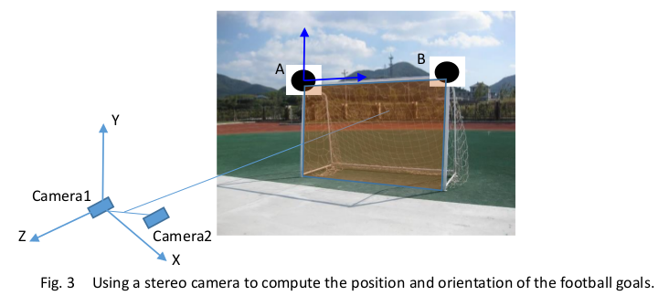
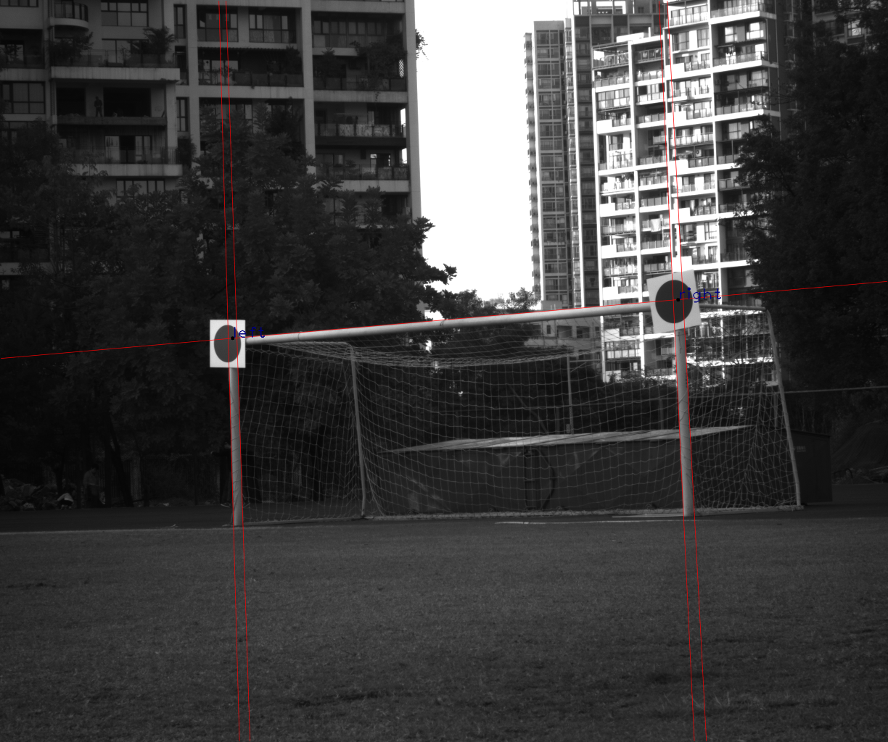
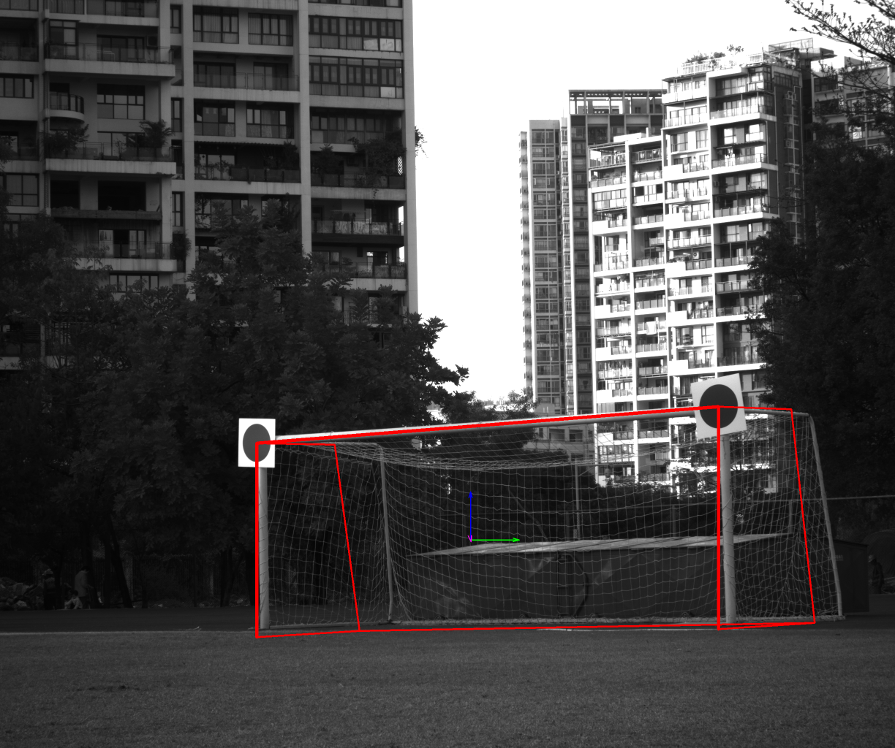

# A Football Goal Localization System using Marker and Line Fitting

This repo is for the projec of the course 'Computer Vision' of HITsz.

## Project introduction

Compute the two corners of the football goal through the stereo camera and the two markers.


## How to run it

ROS Kinetic and pangolin is required.

```
mkdir src
cd src
git clone https://github.com/EpsAvlc/stereo_loc
cd ..
catkin_make
```

## Result




## PPT
[Google Drive](https://drive.google.com/file/d/1TTC98_ROfLKN1HpMYkkBc2hQPKCYCD7q/view?usp=sharing)